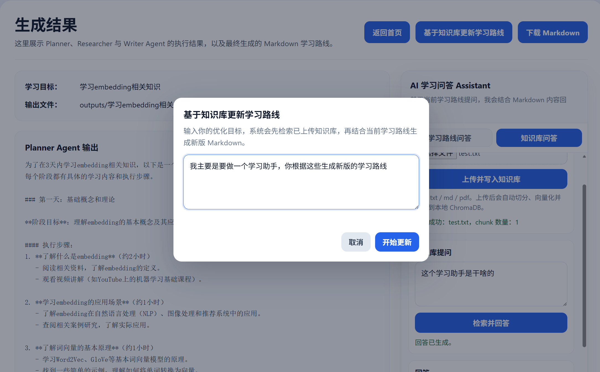
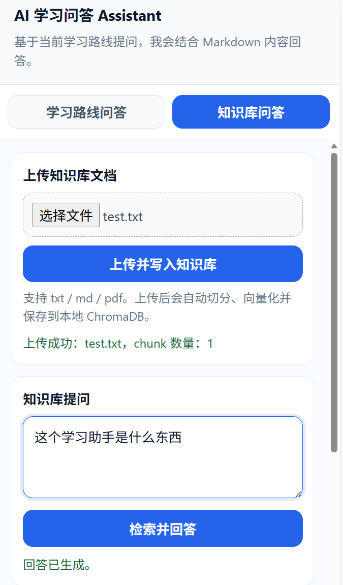

# IntelliFlow AI 智能学习助手

IntelliFlow AI 是一个基于 **Multi-Agent Workflow + RAG** 的智能学习助手。它可以根据用户输入的学习目标拆解学习任务，调用网页搜索整理学习资料，生成结构化 Markdown 学习路线，并支持上传本地文档构建知识库，用 RAG 进行知识库问答或进一步更新学习路线。

这个项目聚焦在一个完整的 AI 应用场景：从目标规划、资料检索、路线生成，到知识库增强问答和基于资料的路线迭代，让用户可以把公开资料和自己的课程大纲、笔记、文档结合起来，得到更贴近自身上下文的学习计划。

## Features

- **Multi-Agent 学习路线生成**：通过 Planner、Researcher、Writer 等 Agent 协作完成学习目标拆解、资料整理和路线生成。
- **Web Search 资料检索**：Researcher Agent 可调用 Tavily Search 检索相关学习资源，并整理为推荐资料和实践方向。
- **RAG 知识库问答**：用户可围绕已上传文档提问，系统先检索相关 chunks，再基于上下文生成回答。
- **文档上传与 Embedding 向量化**：支持上传 `txt` / `md` / `pdf` 文档，自动解析、切分、调用 embedding 模型生成向量。
- **ChromaDB 本地向量数据库**：使用 ChromaDB 持久化保存本地知识库向量，数据目录为 `./data/chroma`。
- **基于知识库更新学习路线**：用户可输入优化目标，例如“结合我上传的课程大纲更新路线”，系统通过 RAG 检索资料并生成新版学习路线。
- **Markdown 学习路线导出**：最终学习路线以 Markdown 形式展示，并支持下载导出。
- **带 sources 的回答引用**：知识库问答和路线更新会返回引用来源，包括文件名、chunk ID 和内容预览。

## Screenshots

### 学习目标输入与首页界面


用户可以输入学习目标、当前水平和学习周期，启动学习路线生成流程。

### Agent Workflow 执行进度展示


页面展示 Planner、Researcher、Writer 等 Agent 的执行状态，方便观察多 Agent 工作流的推进过程。

### 最终 Markdown 学习路线生成结果


结果页展示最终生成的 Markdown 学习路线、Agent 输出内容，并提供聊天和路线修订入口。

### 基于知识库更新学习路线



用户可以输入优化目标，系统结合已上传资料检索到的上下文生成新版学习路线。

### RAG 知识库问答区域



支持上传 `txt` / `md` / `pdf` 文档，系统会自动切分、向量化并保存到本地 ChromaDB，用于知识库问答。

## Architecture / Workflow

```text
用户输入学习目标
  -> Planner Agent 拆解任务
  -> Researcher Agent 搜索资料
  -> Writer Agent 生成 Markdown 学习路线
  -> 用户上传知识库文档
  -> Embedding 向量化并写入 ChromaDB
  -> RAG 检索相关内容
  -> 基于知识库问答或更新学习路线
```

核心模块分工：

| Module | Role |
| --- | --- |
| `Planner Agent` | 拆解学习目标、阶段、模块和执行步骤 |
| `Researcher Agent` | 调用 Web Search，整理学习资源和实践方向 |
| `Writer Agent` | 整合规划和检索结果，生成 Markdown 学习路线 |
| `RAG Service` | 文档解析、切分、embedding、向量入库、检索和问答 |
| `ChromaDB` | 本地持久化保存知识库向量 |
| `FastAPI` | 提供学习路线生成、聊天、RAG 问答和知识库路线更新接口 |

## Tech Stack

- **Python 3.10+**
- **FastAPI**：后端 API 服务
- **LangGraph / Multi-Agent Workflow**：多 Agent 工作流编排
- **OpenAI API**：LLM 生成与 embedding 调用
- **RAG**：检索增强生成
- **Embedding**：使用 `text-embedding-3-small` 进行语义向量化
- **ChromaDB**：本地向量数据库
- **Tavily Search API**：网页资料检索
- **Pydantic**：请求与响应数据模型
- **Jinja2 + 原生 HTML / CSS / JavaScript**：前端页面
- **Markdown**：学习路线输出格式

## API

### 生成学习路线

`POST /generate-plan`

```json
{
  "goal": "学习 Redis",
  "level": "零基础",
  "duration": "2 周"
}
```

### 普通学习路线问答

`POST /chat`

```json
{
  "question": "这条路线第一周应该重点学什么？",
  "context": "# Markdown 学习路线..."
}
```

### 修订学习路线

`POST /revise-plan`

```json
{
  "current_markdown": "# 当前学习路线...",
  "chat_history": [
    {
      "role": "user",
      "content": "补充一些官方文档"
    }
  ],
  "instruction": "把聊天中的资料加入学习路线",
  "output_file": "outputs/example_plan.md"
}
```

### 上传知识库文档

`POST /api/rag/upload`

form-data:

| Field | Type | Description |
| --- | --- | --- |
| `file` | file | 支持 `txt` / `md` / `pdf` |

返回示例：

```json
{
  "filename": "syllabus.pdf",
  "chunks_added": 8,
  "message": "Document uploaded and indexed successfully."
}
```

### RAG 知识库问答

`POST /api/rag/query`

```json
{
  "question": "这份课程大纲的核心学习目标是什么？",
  "top_k": 5
}
```

返回示例：

```json
{
  "answer": "基于知识库生成的回答...",
  "sources": [
    {
      "filename": "syllabus.pdf",
      "chunk_id": "abc123-0",
      "content_preview": "引用片段预览..."
    }
  ]
}
```

### 基于知识库更新学习路线

`POST /api/rag/revise-plan-with-knowledge`

```json
{
  "original_plan": "# 原始学习路线\n\n- 第 1 周：基础学习",
  "instruction": "结合我上传的课程大纲优化学习路线",
  "top_k": 5
}
```

返回示例：

```json
{
  "revised_plan": "# 更新后的学习路线\n\n...",
  "sources": [
    {
      "filename": "syllabus.pdf",
      "chunk_id": "abc123-0",
      "content_preview": "引用片段预览..."
    }
  ]
}
```

## Local Setup

创建并激活虚拟环境：

```bash
python -m venv venv
```

Windows PowerShell:

```powershell
.\venv\Scripts\Activate.ps1
```

macOS / Linux:

```bash
source venv/bin/activate
```

安装依赖：

```bash
pip install -r requirements.txt
```

复制环境变量文件：

```bash
cp .env.example .env
```

Windows PowerShell:

```powershell
Copy-Item .env.example .env
```

配置 OpenAI API Key：

```env
OPENAI_API_KEY=your_openai_api_key_here
OPENAI_BASE_URL=https://api.openai.com/v1
OPENAI_MODEL=gpt-4o-mini
OPENAI_EMBEDDING_MODEL=text-embedding-3-small
RAG_MAX_DISTANCE=0.75
TAVILY_API_KEY=your_tavily_api_key_here
```

启动 FastAPI：

```bash
uvicorn app.main:app --reload
```

访问：

- Web UI: `http://127.0.0.1:8000`
- API Docs: `http://127.0.0.1:8000/docs`

如果 `8000` 端口被占用，可以指定其他端口：

```bash
uvicorn app.main:app --reload --port 8001
```

本地数据目录：

```text
data/uploads   # 上传的知识库文件
data/chroma    # ChromaDB 本地向量库
outputs        # Markdown 学习路线输出
```

## Highlights

- **多 Agent 协同工作流**：将学习规划拆解为目标分析、资料检索和路线写作等清晰步骤。
- **RAG 知识增强生成**：结合用户上传资料进行知识库问答和学习路线更新。
- **Embedding 语义检索**：使用 embedding 向量表示文档 chunks 和用户问题，提高检索相关性。
- **ChromaDB 本地持久化向量库**：知识库数据保存在本地，便于开发、演示和迭代。
- **带 sources 的知识库问答**：回答会展示引用来源，包含文件名、chunk ID 和片段预览。
- **可视化前端交互**：提供 Agent Workflow 进度、Markdown 结果页、RAG 问答区和知识库更新弹窗。
- **完整 AI 应用链路**：覆盖文档上传、解析切分、向量化、入库、检索、上下文增强生成和前端展示。
