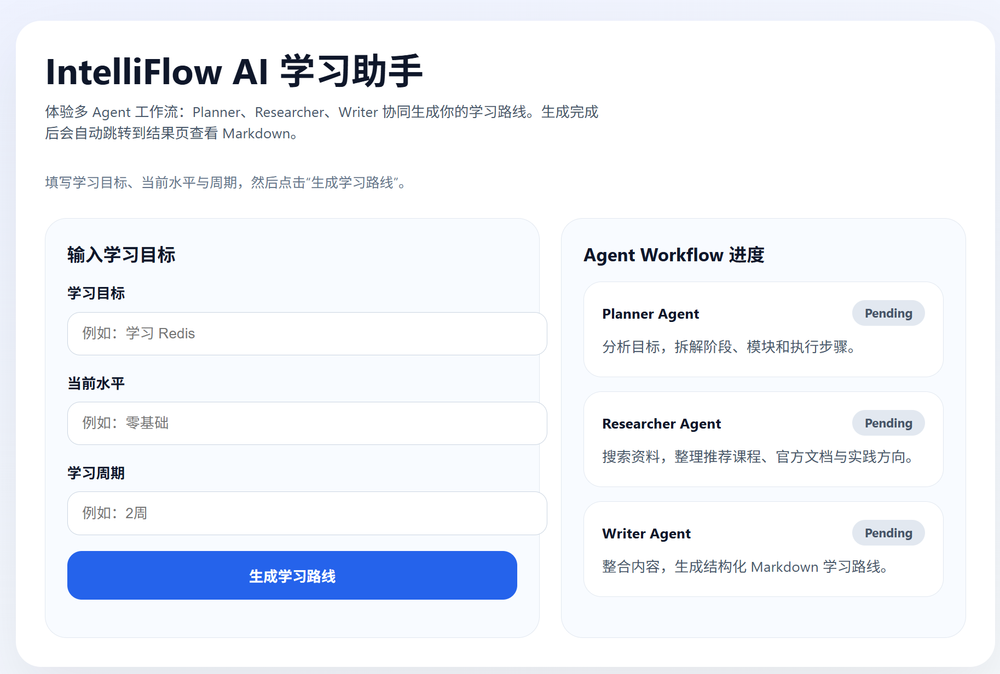
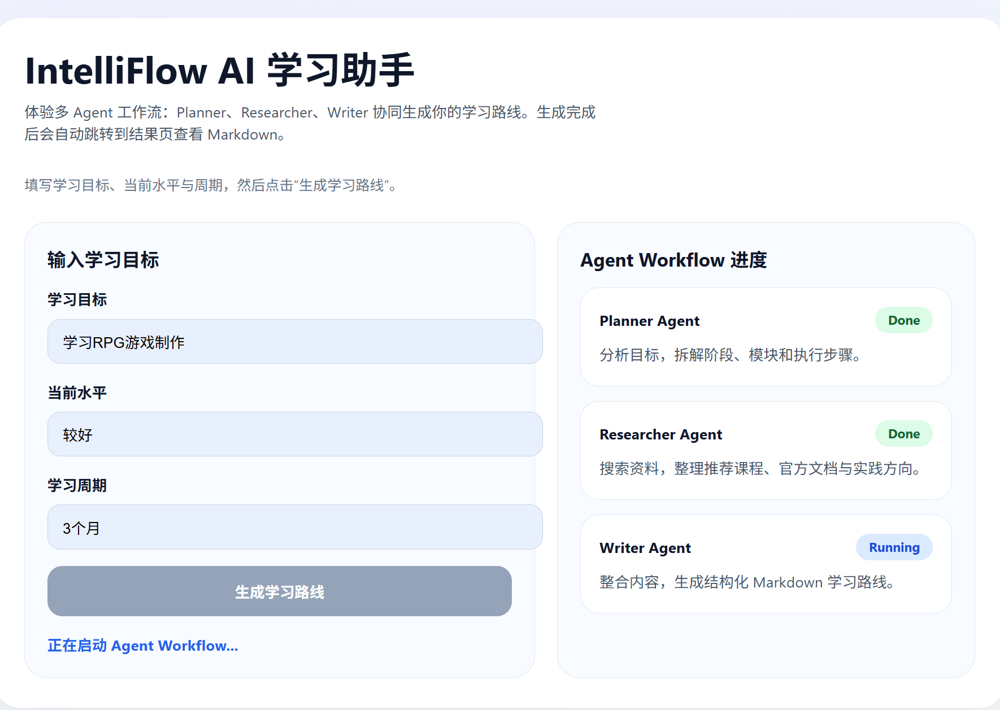
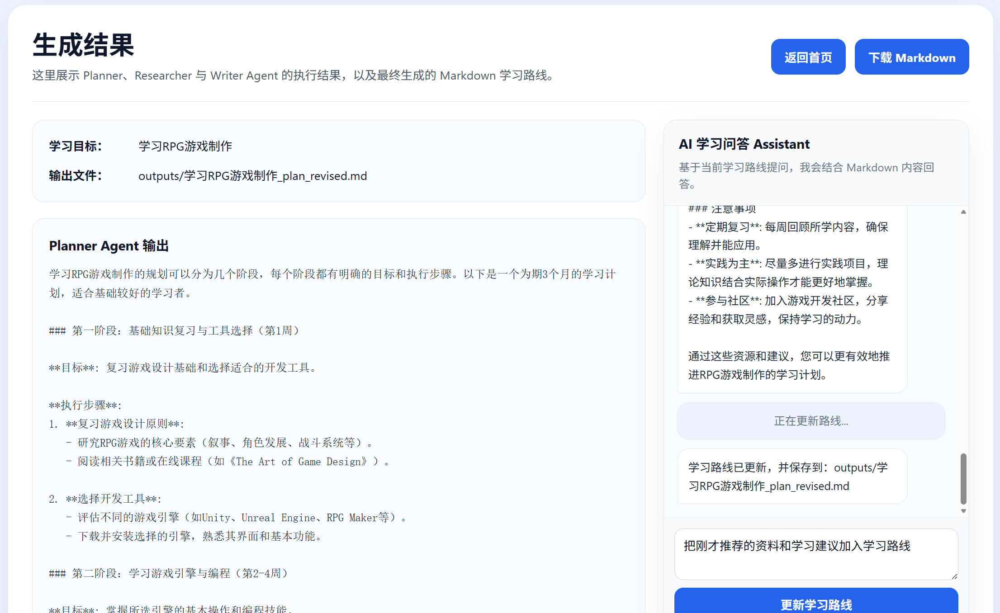

# IntelliFlow AI 智能学习助手

## 项目简介

IntelliFlow 是一个基于 **Multi-Agent Workflow** 的 AI 学习路线生成系统。用户输入学习目标、当前基础和学习周期后，系统会通过多个 Agent 协作完成目标解析、学习阶段规划、网页资源检索、Markdown 路线生成、结果页问答和路线修订。

项目重点不是通用聊天，而是将 **LangGraph Workflow Orchestration**、**Tavily Search**、**Search Augmented Generation** 和 **FastAPI API Design** 组合到一个清晰的学习规划场景中。

核心流程：

```text
User Input
  -> Planner Agent
  -> Researcher Agent + Tavily Search
  -> Writer Agent
  -> Markdown Learning Plan
  -> Reviser Agent
  -> Chat Assistant
```

## Demo



首页用于输入学习目标、当前水平和学习周期，并展示 Planner / Researcher / Writer Agent 的执行状态。

## Multi-Agent Workflow



主生成流程由 LangGraph 编排，按照 `Planner -> Researcher -> Writer` 的顺序执行。页面会展示 Agent 状态切换，便于观察 workflow orchestration 的执行过程。

## Result Page



结果页展示 Markdown 学习路线、Planner / Researcher 输出、输出文件路径，并提供 Chat Assistant 和学习路线修订入口。

## 核心功能

- 输入学习目标、基础水平和学习周期，生成结构化 Markdown 学习路线。
- 使用 LangGraph 编排多 Agent 主流程。
- Researcher Agent 调用 Tavily Search 检索学习资源，并整理为推荐资料和实践方向。
- Chat Assistant 支持围绕当前学习路线继续提问；资源类问题会尝试触发 Tavily Search。
- Reviser Agent 可根据聊天记录和用户修订要求更新学习路线。
- FastAPI 提供 `/generate-plan`、`/chat`、`/revise-plan` 接口。
- OpenAI 或 Tavily 配置缺失时保留 fallback 逻辑，方便本地开发和演示。

## Agent 分工

| Agent / Module | 文件 | 职责 |
| --- | --- | --- |
| Planner Agent | `app/agents/planner.py` | 解析学习目标、基础水平和周期，拆解学习阶段、模块和执行步骤。 |
| Researcher Agent | `app/agents/researcher.py` | 提取学习主题，调用 Tavily Search，整理推荐资料、官方文档方向、实践项目方向和复习重点。 |
| Writer Agent | `app/agents/writer.py` | 整合 Planner 和 Researcher 输出，生成 Markdown 学习路线。 |
| Reviser Agent | `app/agents/reviser.py` | 根据当前 Markdown、聊天记录和修订要求，对学习路线做二次优化。 |
| Chat Assistant | `app/agents/chat_assistant.py` | 基于当前学习路线回答问题，并在资源类问题中调用 Tavily Search。 |

主工作流在 `app/core/workflow.py` 中定义，当前主链路为：

```text
START -> planner -> researcher -> writer -> END
```

`Reviser Agent` 与 `Chat Assistant` 通过独立 API 在结果页阶段使用，不属于主生成链路。

## 技术栈

- Python 3.10+
- FastAPI
- LangGraph
- OpenAI SDK
- Tavily Search API
- Pydantic
- Jinja2 + 原生 HTML / CSS / JavaScript
- Markdown

## 项目结构

```text
IntelliFlow/
├── app/
│   ├── agents/
│   │   ├── chat_assistant.py
│   │   ├── planner.py
│   │   ├── researcher.py
│   │   ├── reviser.py
│   │   └── writer.py
│   ├── api/
│   │   └── routes.py
│   ├── core/
│   │   ├── llm.py
│   │   └── workflow.py
│   ├── models/
│   │   └── schemas.py
│   ├── templates/
│   │   ├── index.html
│   │   └── result.html
│   ├── tools/
│   │   ├── chat_web_search.py
│   │   └── web_search.py
│   └── main.py
├── assets/
│   ├── demo.png
│   ├── demo1.png
│   └── demo2.png
├── outputs/
├── .env.example
├── .gitignore
├── requirements.txt
└── README.md
```

## 本地运行

创建虚拟环境并安装依赖：

```bash
python -m venv venv
pip install -r requirements.txt
```

Windows PowerShell 激活虚拟环境：

```powershell
.\venv\Scripts\Activate.ps1
```

macOS / Linux 激活虚拟环境：

```bash
source venv/bin/activate
```

复制环境变量文件：

```bash
cp .env.example .env
```

Windows PowerShell：

```powershell
Copy-Item .env.example .env
```

`.env` 示例：

```env
OPENAI_API_KEY=your_openai_api_key_here
OPENAI_BASE_URL=https://api.openai.com/v1
OPENAI_MODEL=gpt-4o-mini
TAVILY_API_KEY=your_tavily_api_key_here
```

启动 FastAPI 服务：

```bash
uvicorn app.main:app --reload
```

访问地址：

- Web UI: `http://127.0.0.1:8000`
- Swagger Docs: `http://127.0.0.1:8000/docs`

说明：`.env`、`venv/`、`__pycache__/`、`outputs/` 已在 `.gitignore` 中排除，不建议提交到 GitHub。

## API 示例

### 生成学习路线

`POST /generate-plan`

```bash
curl -X POST "http://127.0.0.1:8000/generate-plan" \
  -H "Content-Type: application/json" \
  -d "{\"goal\":\"学习 Redis\",\"level\":\"零基础\",\"duration\":\"2周\"}"
```

返回示例：

```json
{
  "planner_result": "学习目标：学习 Redis\n当前水平：零基础\n...",
  "researcher_result": "推荐资料类型：\n- 官方文档与入门指南\n...",
  "final_markdown": "# 学习路线：学习 Redis\n\n## 目标说明\n...",
  "output_file": "outputs/学习_Redis_plan.md"
}
```

### Chat Assistant

`POST /chat`

```bash
curl -X POST "http://127.0.0.1:8000/chat" \
  -H "Content-Type: application/json" \
  -d "{\"question\":\"推荐几个 Redis 官方文档和教程链接\",\"context\":\"# 学习路线：学习 Redis...\"}"
```

如果真实调用 Tavily 并获得非 fallback 搜索结果，回答前会带有：

```text
[Web Search Enabled]
```

终端也会输出 Tavily 调试日志：

```text
[TAVILY SEARCH]
query=...
response=...
```

### 修订学习路线

`POST /revise-plan`

```bash
curl -X POST "http://127.0.0.1:8000/revise-plan" \
  -H "Content-Type: application/json" \
  -d "{\"current_markdown\":\"# 学习路线：学习 Redis...\",\"chat_history\":[{\"role\":\"user\",\"content\":\"推荐 Redis 官方文档\"},{\"role\":\"assistant\",\"content\":\"https://redis.io/docs/latest/\"}],\"instruction\":\"把官方文档加入学习路线\",\"output_file\":\"outputs/学习_Redis_plan.md\"}"
```

返回示例：

```json
{
  "revised_markdown": "# 学习路线：学习 Redis\n\n...",
  "output_file": "outputs/学习_Redis_plan_revised.md"
}
```

### Markdown 输出示例

```markdown
# 学习路线：学习 Redis

## 目标说明
- 学习目标：学习 Redis
- 当前水平：零基础
- 推荐周期：2周

## 阶段划分
- 阶段 1：基础理解 - 学习 Redis 核心概念、数据结构、安装和常见命令。
- 阶段 2：进阶实践 - 结合缓存、过期策略、持久化和小项目进行练习。

## 推荐资料与研究方向
- 官方文档与入门指南
- 教程视频与实战博客
- 代码示例与小项目实践

## 每周/每日任务建议
- 第 1 周：完成基础概念、环境安装和常用命令练习。
- 第 2 周：完成一个缓存或计数器小项目，并复盘常见问题。

## 实践项目建议
- 使用 Redis 实现一个简单缓存模块或排行榜案例。

## 复习重点
- Redis 数据结构、典型命令、缓存问题、持久化和基础排查思路。
```

## 项目亮点

- **Multi-Agent Workflow**：将学习路线生成拆分为 Planner、Researcher、Writer 等职责明确的模块。
- **LangGraph Workflow Orchestration**：使用图结构编排 Agent 节点，主流程清晰可追踪。
- **Tavily Search Integration**：通过 Tavily Search 获取网页学习资源，支持 Search Augmented Generation。
- **Markdown Structured Output**：最终输出适合阅读、下载和二次修订的 Markdown 学习路线。
- **FastAPI API Design**：提供清晰的生成、问答和修订接口，便于调试和扩展。
- **Fallback Mechanism**：OpenAI 或 Tavily 未配置时仍可返回降级结果，降低本地运行门槛。

## 当前边界

当前项目保持在学习路线生成和结果页交互范围内，以下能力尚未实现：

- 没有用户登录、权限系统或多用户隔离。
- 没有数据库持久化，生成结果保存到本地 `outputs/`。
- 没有长期记忆、用户画像或跨会话个性化。
- 没有学习进度追踪、任务打卡或完成状态管理。
- 没有对搜索资源做复杂去重、质量评分或可信度排序。
- 没有后台任务队列，接口调用为同步执行。

## 后续优化方向

以下内容属于 future work，不代表当前已经实现：

- 接入数据库，保存学习路线、聊天记录和修订历史。
- 增加学习进度追踪、阶段复盘和任务状态管理。
- 对 Tavily 搜索结果进行来源分类、去重和质量评分。
- 增加单元测试和端到端测试，覆盖 Agent fallback、API schema 和搜索调用逻辑。
- 引入异步任务队列，改善长耗时生成请求体验。
- 增加 Docker 部署配置和更完整的环境模板。
